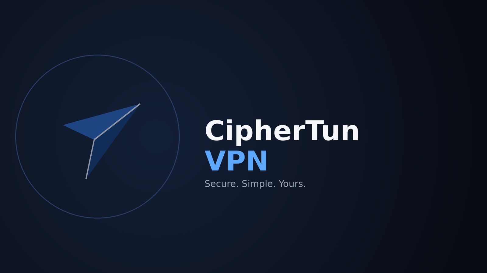

# CipherTun VPN



CipherTun VPN is an Android VPN client built on top of the [sing-box](https://github.com/SagerNet/sing-box) proxy core. It routes your device's traffic through an encrypted tunnel using whichever protocol you configure, with no scripting or manual JSON editing required.

## How it works

CipherTun runs the sing-box core as a native library (compiled Go, bundled as an AAR) inside a foreground Android service. There are two ways it can capture traffic:

- **VPN mode (TUN)** — creates a virtual network interface via Android's `VpnService` API and routes all device traffic through it. This is the default and works without root.
- **System proxy mode** — configures a system-wide HTTP/SOCKS proxy instead of a full TUN interface, for cases where a full VPN isn't wanted or available.

Once traffic reaches the sing-box core, it's encrypted and forwarded to your configured outbound server using the selected protocol. A background command server inside the app streams live connection status, traffic counters, and logs back to the UI in real time, so the dashboard reflects what the core is actually doing rather than a simulated state.

For users on rooted devices, an optional privileged mode (via an Xposed module) allows additional low-level features such as a root network bridge and USB/IP device sharing.

## Setting up a connection — no code required

Tap **Add Configuration**, pick a protocol, and fill in a plain form:

- VLESS, VMess, Trojan
- Shadowsocks
- Hysteria, Hysteria2
- TUIC
- WireGuard
- AnyTLS, ShadowTLS
- SSH
- SOCKS5, HTTP(S) proxy

Each protocol's form only asks for the fields that protocol actually needs (server, port, credentials, and TLS/transport options where relevant). The app builds a valid sing-box configuration from those fields automatically and validates it before saving — you never see or edit raw JSON.

Remote subscription URLs are also supported for importing a list of servers at once, with optional auto-update on an interval.

## Additional features

- Per-app proxy — include or exclude specific apps from the tunnel
- Rule-based routing — bypass LAN traffic, block ads, route by geosite/geoip rule-sets
- Custom DNS — including DNS over HTTPS/TLS and FakeIP
- Live traffic stats and connection inspection
- Crash and out-of-memory reporting for diagnosing issues after the fact
- Network diagnostic tools (STUN test, network quality test)
- Config backup and restore

## Requirements

- Android 5.0 (API 21) or newer
- VPN permission (granted via the standard Android system prompt) for TUN mode
- Notification permission (Android 13+) to show live connection status
- Location permission is only requested if a profile specifically uses Wi-Fi SSID/BSSID-based routing rules — it is not required otherwise, and the data is used solely for that routing decision, never transmitted anywhere

## Version

Current version: **1.14.0-alpha.45**
sing-box core: built against Go 1.25.11

This is a fork under active development — expect the alpha versioning to mean occasional rough edges.

## Building

This project builds via GitHub Actions (see `.github/workflows/android-build.yml`). To build locally, you need JDK 17 and the Android SDK with NDK 28.0.13004108 installed, then run:

```
./gradlew :app:assembleDebug
```

A signed release build additionally requires a keystore and the signing properties described in `app/build.gradle.kts`.
